> 通过官网提供的SDK和GitHub Action 实现自动化调用API [官网SDK地址](https://docs.microsoft.com/zh-cn/graph/sdks/sdk-installation?view=graph-rest-1.0)

## 前提：

##### 已经加入了Microsoft 365 开发人员计划 [链接](https://developer.microsoft.com/zh-cn/microsoft-365/dev-program)

## 使用：
> 由于需要储存密码，如果担心默认管理员账号安全性可以新建一个专用于设置自动续期的账户（小号）。
> 
> 这个小号需要先设置为全局管理员以方便操作，直到完成所有第2部分的步骤。
> 
> 完成所有步骤并且测试运行后可以在E5-Office控制面板取消该账号全局管理员，自动续订依然能正常运行

1. ##### 登录到Microsoft  Azure [链接](https://portal.azure.com/)

2. ##### 注册新应用，新建客户端密码，跟着图片操作，其中 `1` `2` `3` 要记下来
   

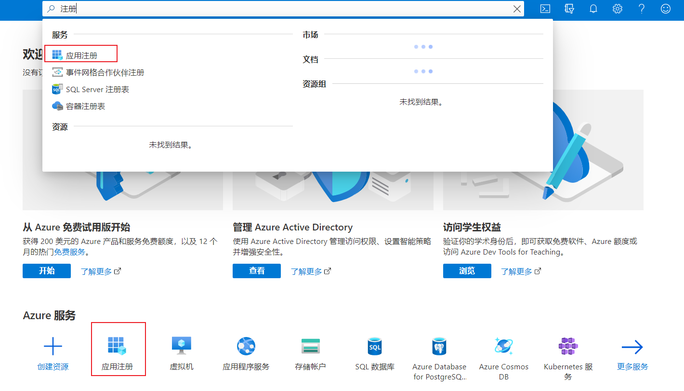
    
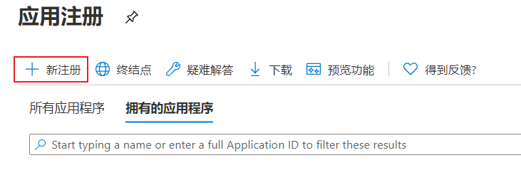
    
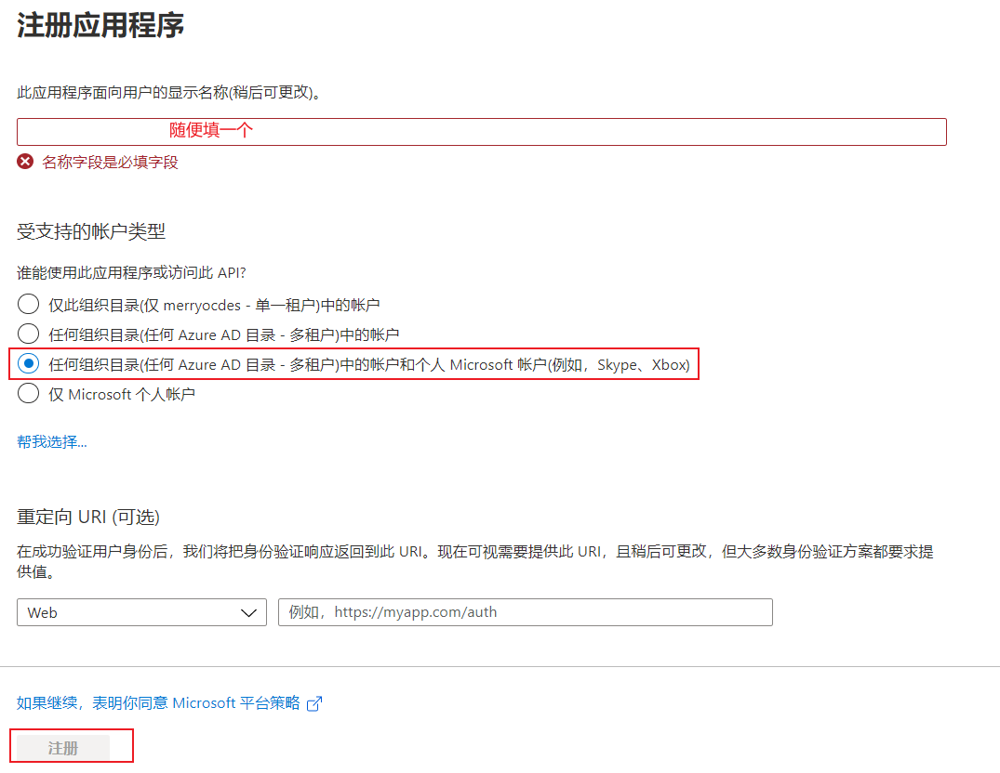
    
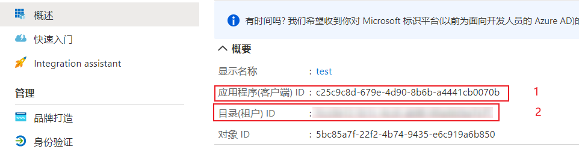
    
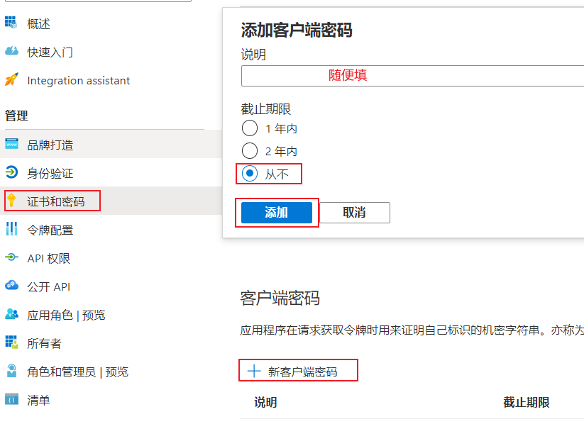
    
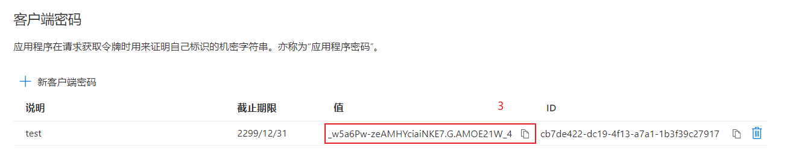
    
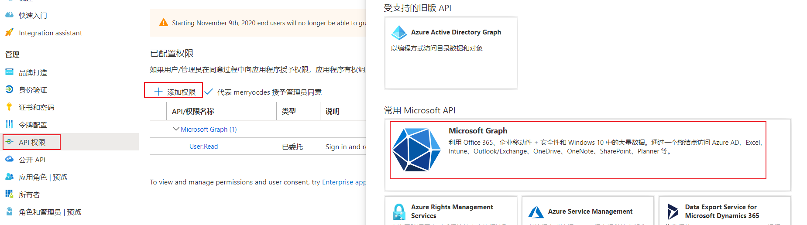
    
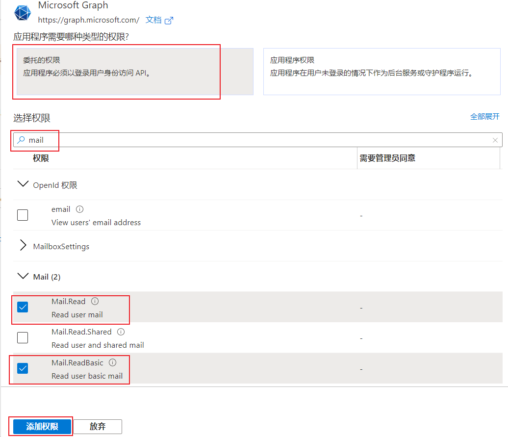
    
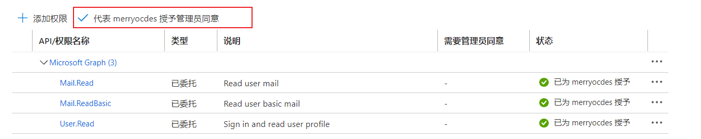

3. ##### 在GitHub仓库中添加 `secrets`

| name          | secrets                                              | No.  |
| :------------ | :--------------------------------------------------- | :--: |
| CLIENT_ID     | 应用程序(客户端) ID                                  |  1   |
| CLIENT_SECRET | 证书和密码中的"客户端密码"                           |  3   |
| TENANT_GUID   | 目录(租户) ID                                        |  2   |
| USERNAME      | 登录Microsoft Azure的账号(xxxx@xxxx.onmicrosoft.com) |      |
| PASSWORD      | 登录Microsoft Azure的密码                            |      |
| TOKEN         | GitHub Token                                         |      |

> **其中的 `TOKEN` 获取在GitHub `Setting` -> `Developer settings`  -> `Personal access tokens` 中获取，用于更新日志** 
> **或者[点击这里](https://github.com/settings/tokens/new)新建一个 Personal access token，命名随意**

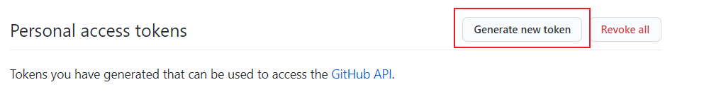

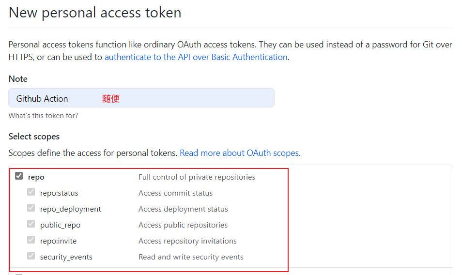

> **在项目中的 `setting` 里面添加**

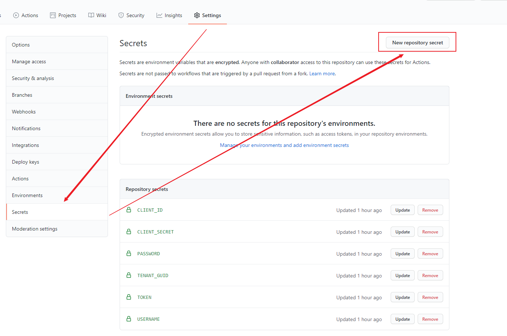

> **在`setting`-`Actions`-`General`里`Workflow permissions`选择“Read and write permissions”权限，否则push log会失败**

4. ##### 修改 [`.github/workflows`](/.github/workflows)中的`main.yml`，修改成自己的用户名和邮箱

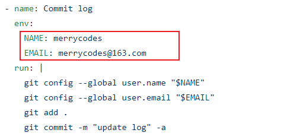

5. ##### 最后必须要自己 `star` 一下才会开始运行，测试的的时候只要点两次就好了（取消star，然后再star）

## 本地

用 `main.md` 中的代码替换 `Main.class` 中的代码，并把在 `resources` 目录中的 `officeE5.properties` 文件中的值替换成自己的

## 参考链接

[yml文件配置](https://github.com/moreant/auto-checkin-biliob)

[Microsoft Graph SKDK 邮件API](https://docs.microsoft.com/zh-cn/graph/api/user-list-messages?view=graph-rest-1.0&tabs=http)
